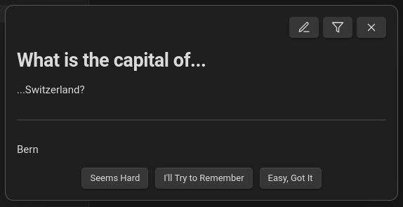

# Obsidian — The Queue


There is no point in creating notes you never see again! 


*The Queue* is a plugin for [Obsidian.md]() that shows you random notes from your vault, one at a time. You can configure your notes to function as habits, flashcards, iterative reading prompts, to-dos and more.

## What The Queue can help you with

1. Overcoming favorite & forget
2. Gradually building up a genuine Zettelkasten
3. Low-friction iterative reading
4. Spaced Repetition flashcard learning
5. Getting through to-do lists without being overwhelmed
6. Building & tracking habits (a lot of them, if you want)
7. Intersperse boring or unpleasant work with fun and enjoyment
8. Serendipitously discover connections between your notes
9. Improving your PKM in a gradual, natural way

## Installation

*The Queue* is not yet available through the `Community Plugins` tab in Obsidian (WIP). You can manually install it like so:


- *obligatory warning: This plugin edits your metadata. *

## Getting Started

1. Click the little die (⚄) in your ribbon.
2. Here you go!


## Usage, Features and Functionality

(in detail)

### Frontmatter Settings

1. *The Queue* always shows one of your notes at a time
2. How exactly your note is treated is depending on its *frontmatter* (also called *metadata*)

If you never heard of frontmatter, I recommend [this excellent introduction](https://notes.nicolevanderhoeven.com/obsidian-playbook/Using+Obsidian/03+Linking+and+organizing/YAML+Frontmatter). 

*The Queue* uses a bunch of frontmatter properties, **all of them optional**. As a rule, they start with `q-`. This is an attempt to avoid clashes with other plugins or workflows that use otherwise similarly named properties.

Below is an example note with all properties that *The Queue* can interpret.

```
---
q-type: habit
q-interval: 3
q-priority: 5
q-keywords: 
  - at home
  - break
q-topic: Home Exercise
q-data:
  due-at: 2024-02-26T03:00:00.000Z
aliases: 
  - Situp Habit
---

Do (at least) 3 sit-ups. Go!
```

Here is an overview of all properties and what they're used for:

| Frontmatter Property | Possible Values | Usage/Meaning |
| --- | --- | --- |
| `q-type` | *see [Types of notes](#types-of-notes)* | Determines how the note will be treated and which buttons you see. *Most important*.
| `q-interval` | any positive number (like `3`, or `0.2`) | How often a note will show up, measured in days. 
| `q-priority` | any number | Whether this note will be prioritized compared to other notes due at the same time — the higher the value, the more likely it will be picked.
| `q-keywords` | any text | *see [Filtering](#filtering)*
| `q-topic` | any text | Additional text that will show up on the top right of the note when it is displayed in the queue. As of now, purely visual.
| `q-data` | — | An object used to keep track of various values that are internally relevant to *The Queue*. Unless you are transferring notes from another system, you will never have to touch this.

Again, all of these properties are optional. You can set some, all or none of them. For examples, this is also a completely valid note that will be understood by *The Queue*:

```
---
q-priority: 15
q-topic: being present
---

I like watching the clouds pass by.

```

Which properties you need depends highly on what kind of note you are creating (as determined by `q-note`). In the next chapter, you will learn about all the different types of notes in *The Queue*. 

### Types of notes

Setting `q-type` in the frontmatter of a note will tell *The Queue* how to treat it — is it a habit? A to-do? A learning flashcard?

First of all, here is a list of all `q-type`s that *The Queue* is aware of:

|  `q-type` value  | Note Type | Treatment |
| --- | --- | --- |
| `learn` | Learning Flashcard | A Spaced-Repetition flashcard where you initially only the front side. |
| `todo` | To-Do | A task that you only have to do once. Will be hidden once it's finished.
| `habit` | Habit Prompt | A recurring habit that you want to establish. Will prompt you to do the task on the note every time it comes up. |
| `check` | Check-In | Like a habit, but phrased as a question and looking back. It's a bit hard to explain but very useful. |
| `article` | Article | Something like a blog post or similar mid-sized content. Will prompt you to read a bit everyday until you are done. |
| `book` | Book | A book on your reading list. Will also prompt you to read daily, but *The Queue* will limit the books that you read simultaneously. |
| `misc` | Miscellaneous | Just...some kind of note. Basically just shows up and you say 'ok'. |
| value not set, or none of the above | " " | Treated like `misc`. All your notes are of type `misc`, unless you specify otherwise.| 
| `exclude` | Excluded Note | This note will not show up in the queue. |

*There are some additional types used internally. See [here](#additional-secret-types) if that interests you.*

In the following chapters, you will learn about every type of note in detail. At the end, you can customize how notes will show up in your queue to your heart's desire.

#### Standard notes / Miscellaneous / Default
##### Useful for...

1. thoughts that you occasionally want to be reminded of
2. quotes that you like but don't want to exactly memorize
3. paintings, memes, silly things
4. photos that you took; memories

#### Learning flashcards

##### Useful for...

1. learning vocabulary
2. memorizing quotes
3. studying for exams

##### Examples

- For simple notes, *The Queue* will interpret the title of the note as the front (the question) and the note's content as the back side (the solution). See below:

`I like cold pizza.md`

```
---
q-type: learn
---

Mi piace la pizza fredda
```


- It is also possible to define the front and the back side of the flashcard within the note's content
- As you can see below, there is nothing stopping you from putting additional content on a flashcard

`Vienna Secession Period.md`

```
---
q-type: learn
---

The [[Vienna Secession]] started ＿ and ended 1905.

---

1897

- → [[design-periods]], [[Vienna]]
- *remember*: just around the turn of the century
```


##### Functionality

- Which flashcard is shown when is determined by [ebisu](https://github.com/fasiha/ebisu.js), an innovative Spaced Repetition algorithm.
    - Essentially *ebisu* determines which note is most likely to be forgotten soon.
    - Your answer after every repetition influences this value.
- Flashcards that are encountered for the first time show up with a different interface, where both front and back are displayed immediately — after all, you are not expected to have them memorized yet.
    - Your answer about the perceived difficulty of the flashcard will influence when it is show for the second time.



- If you get a flashcard wrong a lot, it will be marked as a *leech* (inspired by the [Anki concept](https://docs.ankiweb.net/leeches.html)) — see the section on [Leech Improvement](#leech-improvement) for additional information.


#### Check-Ins 
#### Leech Improvement 

#### Orphan Adoption

#### Additional, (secret) types

*The [type list at the beginning of the chapter](#types-of-notes) is actually not exhaustive. They are some additional types that the software uses internally. Unless you are transferring from a different system or hacking the system on an advanced level, you will never need to set them. Anyways, for completion's sake, here they are:*

|  `q-type` value  | Usage |
| --- | --- |
| `learn-started` | A `learn` note after it's been shown for the first time. This distinction lets the software know whether to reveal the card immediately (because it's shown for the first time) or not |
| `todo-done` | A `todo` that the user has completed. Treated the same as `exclude`. We opted for this option because we did not want to trigger destructive actions (like deleting a note) from *The Queue*. |
| `book-started` | A `book` that you are actively reading. Used to keep track of the number of books read at the same time. |
| `book-finished` | A `book` that is completely read. Treated the same as `misc`; the distinction only exists so that the note is still clearly recognizable as a book. |

After this tangent, here is some more stuff you can do within *The Queue*:

### Features

#### Editing

#### Logging

#### Filtering

#### Settings


## Tips & Tricks

#### The orphan prompt works great with AutoMOC

#### Design learning flashcards well

- Wozniak's flashcard design tips

## Credit

This ongoing project is the culmination of quite a few years of researching and tinkering. As such, it incorporates uncountable ideas, approaches, tools and concepts that others have built. I could not possibly name (or even remember) all of them, so here is a non-exhaustive list of the most integral sources that enabled me to create this:

1. [Obsidian.md](https://obsidian.md/), which is not only the software this is built upon but also how I organize my thinking around it.
2. [Piotr Wozniak's writing](https://supermemo.guru), which gave me many pointers on Spaced Repetition, iterative reading and more.
3. [ebisu](https://github.com/fasiha/ebisu.js), the algorithm that flashcards are based on.
4. The writings of Cal Newport, Niklas Luhmann, James Clear, Jeff Olson, Maxwell Maltz, Mihaly Csikszentmihalyi and many others, who all influenced my thinking about note-taking, productivity, learning and habits.
