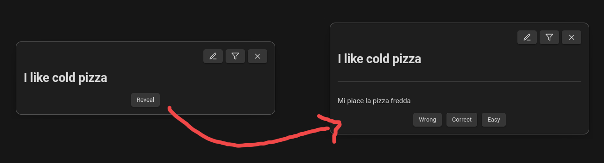

# The Queue for Obsidian

There is no point in creating notes you never see again! *The Queue* shows you random cards you made, one after the other. But that's not everything! You can use this for spaced repetition learning, habits, and many more.

### Credit

- SM-2 and the wiki

### Types of notes

#### Learning Flashcards

##### Examples

- For simple notes, *q* will interpret the title of the note as the front (the question) and the note's content as the back side (the solution). See below:

`I like cold pizza.md`

```
---
q-type: learn
---

Mi piace la pizza fredda
```



- It is also possible to define the front and the back side of the flashcard within the note's content
- As you can see below, there is nothing stopping you from putting additional content on a flashcard

`Vienna Secession Period.md`

```
---
q-type: learn
---

The [[Vienna Secession]] started __ and ended 1905.

---

1897

- → [[design-periods]], [[Vienna]]
- *remember*: just around the turn of the century
```


### Tips & Tricks

#### The orphan prompt works great with AutoMOC

#### Design learning flashcards well

- Wozniak's flashcard design tips