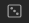

# Obsidian — The Queue

There is no point in creating notes you never see again! 

*The Queue* is a plugin for [Obsidian.md]() that shows you random notes from your vault, one at a time. You can configure your notes to function as habits, flashcards, iterative reading prompts, to-dos and more.

It does this by simply opening a floating button bar in the corner, which allows you to react to the currently open note, and then get another note.

> [!NOTE]  
> You are reading the documentation of The Queue 2, an all-new version recently released.
> I implemented some fundamental changes.
> If you're looking for the old documentation, see [here](OLD_README.md).
> If you used the previous version, you have to do nothing, although it is recommended to redesign your `learn` notes as described below. 


## What *The Queue* can help you with

1. Overcoming favorite & forget
2. Gradually building up a genuine Zettelkasten
3. Low-friction iterative reading
4. Spaced Repetition flashcard learning
5. Getting through to-do lists without being overwhelmed
6. Building & tracking habits (a lot of them, if you want)
7. Intersperse boring or unpleasant work with fun and enjoyment
8. Serendipitously discover connections between your notes
9. Improving your PKM in a gradual, natural way

## Installation

### As Community Plugin

*The Queue* is available as a community plugin, so you can install it like every other plugin.

### Manual

1. Download this repository as a `.zip` file and unzip
2. Locate your Obsidian plugin folder and copy the project folder there
3. Activate `The Queue` in your Community Plugins tab in your Obsidian Settings

If any of these steps cause you trouble, refer to *Method 2* in [this excellent installation guide](https://www.makeuseof.com/install-obsidian-plugins/).


## Get Started

1. Select the little $ICON in your ribbon. ()
2. You are in your queue, have fun!

## Usage, Features and Functionality

### Frontmatter Settings

1. *The Queue* always shows one of your notes at a time
2. How exactly your note is treated is depending on its *frontmatter* (also called *metadata*)

If you never heard of frontmatter, I recommend [this excellent introduction](https://notes.nicolevanderhoeven.com/obsidian-playbook/Using+Obsidian/03+Linking+and+organizing/YAML+Frontmatter). 


To define how a note should be treated by *The Queue*, you set the `q` property in the frontmatter, for example:

```
---
q:
  template: habit
  interval: 3
---

Clean your desk

```

For most note types, you set only the `template`, for some, you may also want to set the desired `interval` in days. All possible templates are described below.
If you don't set an interval, a default interval of 1 day is assumed.

### Types of Notes

#### Standard notes / Miscellaneous / Default

If a note has no `template`, an invalid one, or `template: misc`, it will be handled as shown here.

##### Useful for...

1. thoughts that you occasionally want to be reminded of
2. quotes that you like but don't want to exactly memorize
3. paintings, memes, silly things
4. photos that you took; memories

##### Example

```
> Everything worth doing is worth doing badly

```

```
---
q:
  template: misc
---

> Everything worth doing is worth doing well

```


#### Learning/Spaced Repetition

To memorize notes, use `template: learn`.

##### Useful for...

1. learning vocabulary
2. memorizing quotes
3. studying for exams

##### Examples

```
---
q:
  template: learn
---

> [!faq]- What is the capital of Italy?
> Rome
```

It highly recommended that you use a collapsed [callout](https://help.obsidian.md/Editing+and+formatting/Callouts) to first hide the information that you want to memorize.

So, the flow is: Read the question, try to remember the answer, expand the callout, check the answer and select `Wrong`, `Hard`, `Correct` or `Easy`.


#### Habits 

Habits are a lot like to-dos — however, they are recurring. You set them with `template: habit`.

##### Useful for...

1. enhancing your productivity (e.g. *plan the rest of your day*)
2. iteratively improving your note-taking system (e.g. *import browser bookmarks to Obsidian*)
3. taking care of your health (e.g. *stand up and roll your shoulders*)
4. staying on top of social obligations and relationships (e.g. *convert at least 1 email in your inbox to a to-do and delete it*)
5. almost any kind of habit that you want to establish, honestly

##### Example

```
---
q:
  template: habit
  interval: 7
---

Clear out email inbox

```

##### Set yourself up for success with habits

No matter how many habits you choose to put into your queue, we advice you to design them carefully. Having habits that feel to big, too undefined or too dreadful can quickly take out the fun. Some tips:

1. Set [Smart Goals](https://www.atlassian.com/blog/productivity/how-to-write-smart-goals) on every habit note
2. Set an optional *Minimum Viable Habit*: A tiny action in the right direction that is possible to do even when you are at your worst
3. Specify exceptions: What do you do when it's impossible to do the habit right now?

Take special care when you use `habit` notes for self-change or mental health concerns. It's no win to create a habit to feel better only to then feel worse because you're not up for doing it. Three additional recommendations here:

1. Create `habit` notes for habits you already do anyways; to build trust in your ability to do so.
2. Consider `habit` notes for things that are fun, silly, useless or unrelated to your goals, such as *eat a piece of chocolate and really enjoy it*.
3. For new habits, start tiny. For example, if you want to establish mood tracking, try *draw a smiley about how you feel in your notebook* instead of *write a 1-page diary entry*.

Please be aware that all these are just cheap hacks, attempting to simplify the extremely intricate topics of mental health and identity. Be kind to yourself.

And most importantly, know that *The Queue* can not replace human contact nor a mental health professional.

#### Check-Ins

*Check-Ins* are a little bit strange, but very neat. They are like habits, but formulated as a question to yourself and usually looking at the past or the general state of things. Here a few examples:

- *Did you go to bed at a reasonable time yesterday?*
- *Are you spending enough time with your family?*
- *Do you have a glass of water within reach?*

##### Useful for...

1. establishing habit systems that can't be supported by prompting specific actions in the moment, for example relating to sleep, exercise or lifestyle.
2. checking in with yourself on a broader scale, e.g. spiritually, regarding mental health, career trajectory, etc.
3. validating that you are actually applying learned concepts, processes or ideas

##### Example

```
---
q:
  template: check
  interval: 100
---

are you happy with your desk setup?

```

##### Be gentle & take care of yourself

We ask you to be careful with this type of note. While there is likely nothing wrong with checking whether you have a glass of water on your desk, analyzing your own mental health is a serious endeavour.

While "*Are you happy with yourself?*" may be the ideal prompt for one person to adjust their priorities, it may spiral into self doubt for another.

If you choose to use `check` for these things, be gentle and kind. Set yourself up for easy wins, especially in the beginning or when attempting big changes in your life.

And please remember, *The Queue* can not replace human contact nor a mental health professional.

#### To-Dos

To-dos are marked by setting `template: todo` in the frontmatter.

##### Useful for...

1. tasks that you have to do once

#### Example

```
---
q:
  template: todo
---

open that letter from the bank lying on my desk

```


#### Media/Iterative Reading

[Iterative Reading](https://en.wikipedia.org/wiki/Incremental_reading) is a method of getting through long reading lists. Instead of reading one article (or whatever) after another, you read everything "at the same time". *The Queue* makes this possible by randomly showing you articles you saved, prompting you to read a bit — it is up to you whether you stop after a sentence or a chapter. Bit by bit, you make progress, until you finished a given document. 

To have a note show up in your queue in this manner, you have to set `template` to `shortmedia` or `longmedia`

As you will see, the two types are treated almost the same. The difference is that *The Queue* limits the number of long media you consume at a time, while the number of active `shortmedia` is unlimited.


##### Useful for...

1. `shortmedia`:
  - blog posts
  - news articles
  - videos
  - (long-ish) emails
  - any kind of content that takes 1 - 45 minutes to consume and understand
2. `longmedia`:
  - books
  - long-form video, including movies
  - long essays
  - any kind of content that feels like a project to get through

##### Examples

```
---
q:
  template: longmedia
---

📖 Dune

```

```
---
q:
  template: shortmedia
---

[📰 Everything Is Broken](https://medium.com/message/everything-is-broken-81e5f33a24e1)

```


#### Exclude

If you set `template: exclude`, notes will be ignored, i.e. not opened by *The Queue*.


## Credit

This ongoing project is the culmination of quite a few years of researching and tinkering. As such, it incorporates uncountable ideas, approaches, tools and concepts that others have built. I could not possibly name (or even remember) all of them, so here is a non-exhaustive list of the most integral sources that enabled me to create this:

1. [Obsidian.md](https://obsidian.md/), which is not only the software this is built upon but also how I organize my thinking around it.
2. [Piotr Wozniak's writing](https://supermemo.guru), which gave me many pointers on Spaced Repetition, iterative reading and more.
3. [ebisu](https://github.com/fasiha/ebisu.js), the algorithm that flashcards used to be based on.
4. [FSRS](https://github.com/open-spaced-repetition/ts-fsrs), the new flashcard algo.
4. The writings of Cal Newport, Niklas Luhmann, James Clear, Jeff Olson, Maxwell Maltz, Mihaly Csikszentmihalyi and many others, who all influenced my thinking about note-taking, productivity, learning and habits.
5. The folder settings' code is inspired by [Templater](https://github.com/SilentVoid13/Templater/blob/0596dc2c756e8c581d55ca3fd897abcb01f6c271/src/settings/suggesters/FolderSuggester.ts), which in turn credits [Liam's Periodic Notes Plugin](https://github.com/liamcain/obsidian-periodic-notes)

## Running Locally & Contributing

Pull requests are always welcome — for ideas, complaints, feature requests or software patches.

There are no specific guidelines for contributing as of now; be pleasant and kind.

Detailed instructions for running the project locally are still pending, however this is just a basic `ts` project. Cloning it locally, installing dependencies with `npm i` and then running it with `npm run dev` should work fine. To use it in Obsidian, you have to put the project folder in your plugin folder.

To start hacking away at the plugin, check `DOC.md` for a brief introduction on where to find what functionality.

If you have any trouble, please open an issue. Cheerz!

## Roadmap

*(coming soon, hopefully)*

- settings menu
- optional daily note limit
- better documentation :)
- allow filtering
- allow blacklisting folders
- enable prio